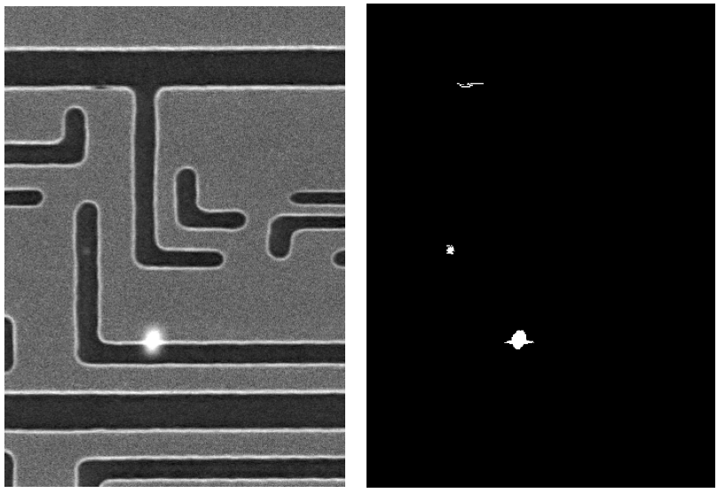

# Defect Detection in Semiconductor Chips

This project focuses on detecting and analyzing defects in semiconductor chips by aligning inspected and reference images and generating a reliable binary defect mask.

Technical report is provided [here](https://github.com/shani1610/defects-detection/tree/main/report).

 

# Table of Contents

1. [Installation](#installation)
2. [Running](#running)
3. [File Structure](#file-structure)

# Installation:

Clone the repository:

```
git clone https://github.com/shani1610/defects-detection.git
cd defects-detection
```

Create a Virtual Environment:

```
python -m venv venv
```

Activate the Virtual Environment:

On Windows (Command Prompt):

```
venv\Scripts\activate
```

On macOS/Linux:

```
source venv/bin/activate
```

Install Required Packages:

```
pip install -r requirements.txt
```

# Running:

The main.py script runs the full pipeline.

```
python main.py <inspected image path> <reference image path> --defects_file <defects file path (optional)> --plot <True\False (optional)> 
```

By default, plot is False, meaning only the final defect mask is visualized. Set plot=True to visualize intermediate steps.

Example Runs:

```
python main.py data/defective/case1_inspected_image.tif data/defective/case1_reference_image.tif
python main.py data/defective/case2_inspected_image.tif data/defective/case2_reference_image.tif
python main.py data/non_defective/case3_inspected_image.tif data/non_defective/case3_reference_image.tif
```

Run All Cases in One Command (macOS/Linux only):

```
chmod +x ./scripts/run_defect_detection.sh
./scripts/run_defect_detection.sh
```

# File Structure:

```
defects-detection/
│── core/
│   ├── __init__.py
│   ├── visualize.py
│   ├── analyze.py
│   ├── align.py
│   ├── preprocess.py
│   ├── gmmpipe.py
│   ├── fftpipe.py
│   ├── postprocess.py
│── scripts/
│   ├── run_defect_detection.sh
│── data/
│   ├── defective/
│   │   ├── case1_inspected_image.tif
│   │   ├── case1_reference_image.tif
│   ├── non_defective/
│── notebooks/
│   ├── deep_learning_feature_matching.ipynb
│── report/
│── main.py
│── requirements.txt
```

# To Do: 

Add support in config file for the parameters such as FFT Filter size, Feature Matching method etc. 

