# Report on Defect Detection

## Introduction

Semiconductors are manufactured using silicon, and individual silicon pieces are sampled to identify defects. Traditionally, defect detection involves comparing one chip with its neighboring chip due to the generally low probability of defects. In this report, I propose a novel approach that leverages both a reference image and an inspected image to detect defects more effectively.

**Challenges**
Defects can vary significantly in size, from as small as a single pixel to as large as half the image, and may exhibit diverse shapes and intensity levels, presenting a complex detection scenario.

**Goal**
The objective is to develop a highly generic algorithm that can adapt to various defect characteristics and imaging conditions.

**Output**
The final output will be a binary image clearly indicating the detected defects.

## Examine

First, let's examine what our inputs and desired output are. 

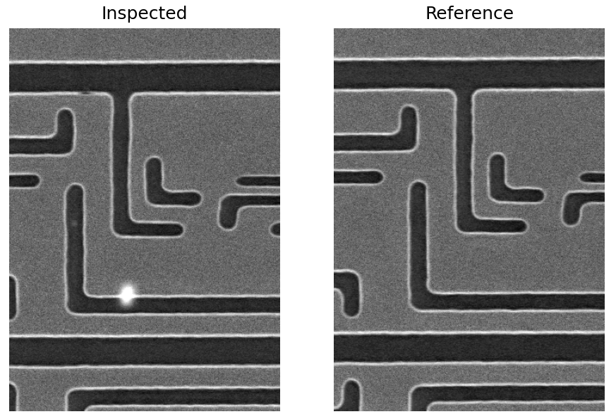

*In this image, we can see on the right the inspected image compared to the reference image.*


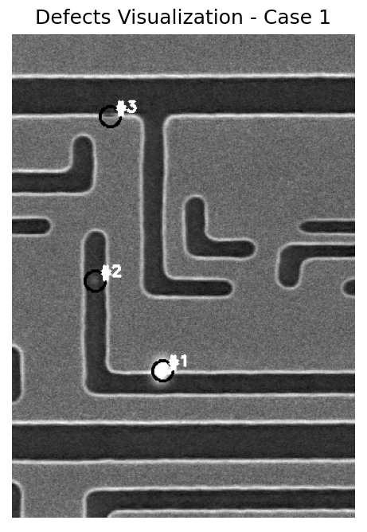 

*Here are the defects marked by the locations given in the text (a circle of size 10 around each location). We can see that defect #1 is quite noticeable, but defects #2 and #3 are harder to detect.*

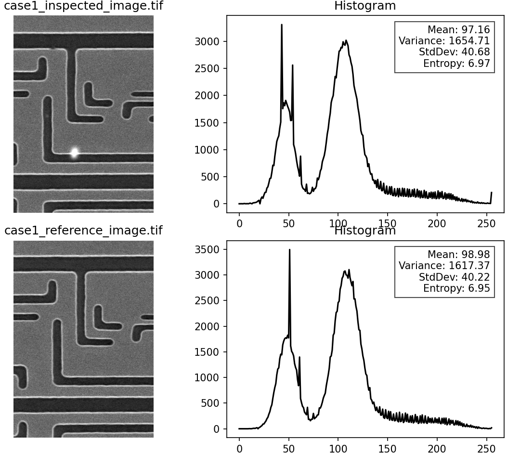 

*This image shows the histogram and some statistical information. We can see that around gray level 42 there is a peak in the defect that is not seen in the reference. Overall, the histogram and statistics are quite similar, so we didn't apply any normalization, standardization, or other operations.*

# Alignment 

Although the images are similar and have the same orientation and grayscale distribution, they are not perfectly aligned. To accurately detect the defects, the images must be aligned. Alignment can be achieved using feature matching approaches. The most well-known method is SIFT, which is based on three steps: interest point detection, description of these interest points using a histogram of oriented gradients, and matching of the descriptions using kNN-based matcher or another matcher. However, results with SIFT weren't satisfactory, so I used ORB. ORB is efficient alternative to SIFT. it uses FAST keypoint detector and BRIEF descriptors and uses pyramid to produce multiscale features. 

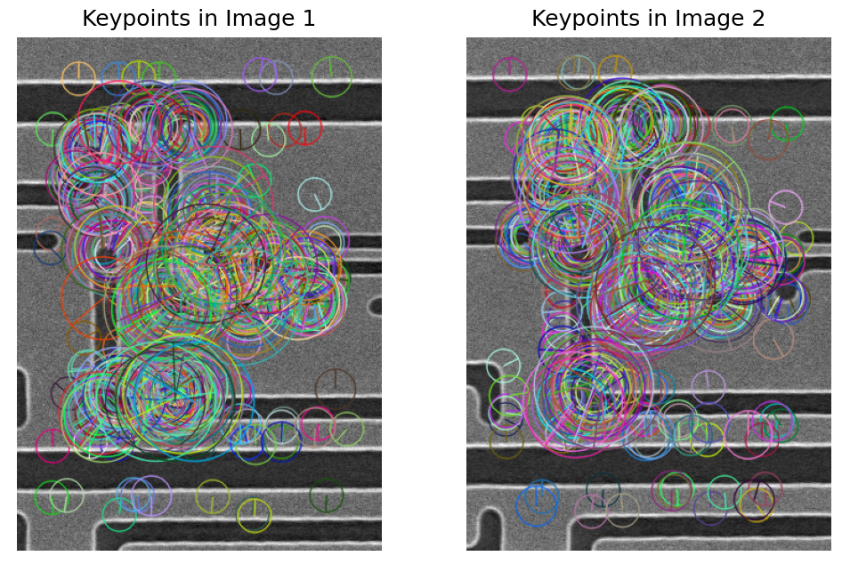

*Here we can see the keypoints from ORB. The size of the blob indicates the interest point region (a corner in a large blob is not necessarily a corner in a smaller blob), and the line represents the principal orientation.*

After feature matching, we proceed to homography calculation and we use RANSAC, an iterative method to refine the model and achieve a consensus among most matches.

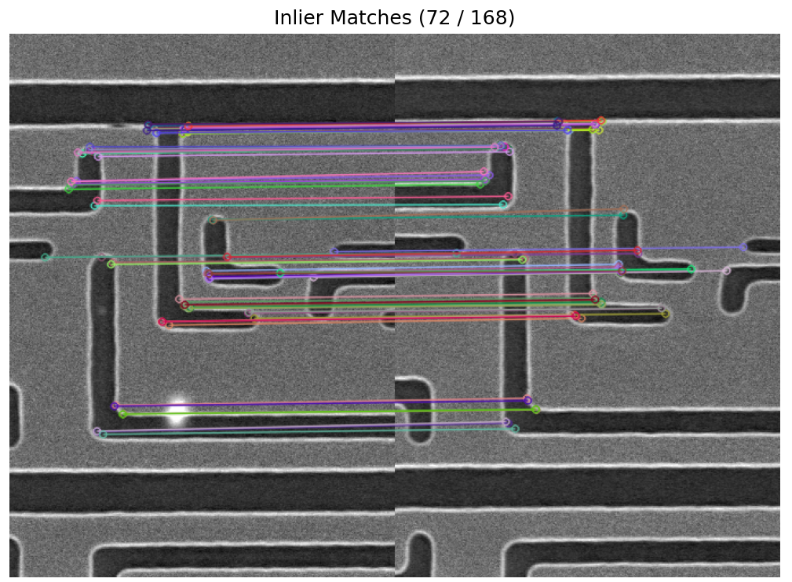 

*Here we can see the inlier matches, which show quite good correspondence.*

We then use the function ```warpPerspective``` to overlay the images on top of each other.

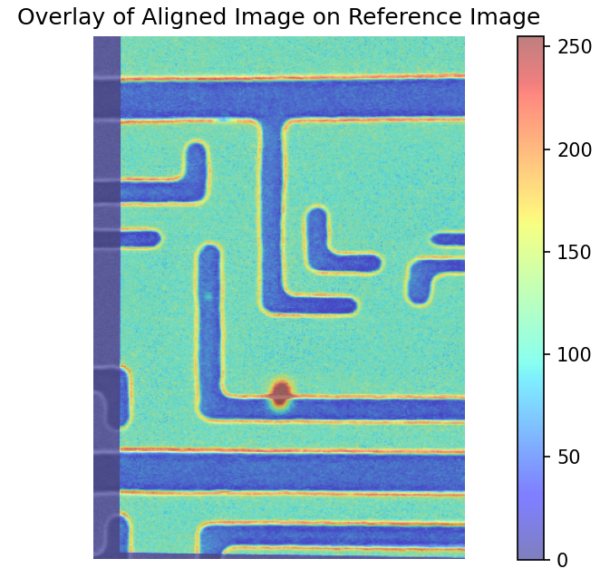 

*In this image, there are parts that are not perfectly overlaid. some of the edges differ. This hints at potential future issues.*

Next, we calculate the difference image. Ideally, only the defects should be visible in the difference image, since everything else should be identical. However, we can clearly see some of the chip pattern edges and noise.

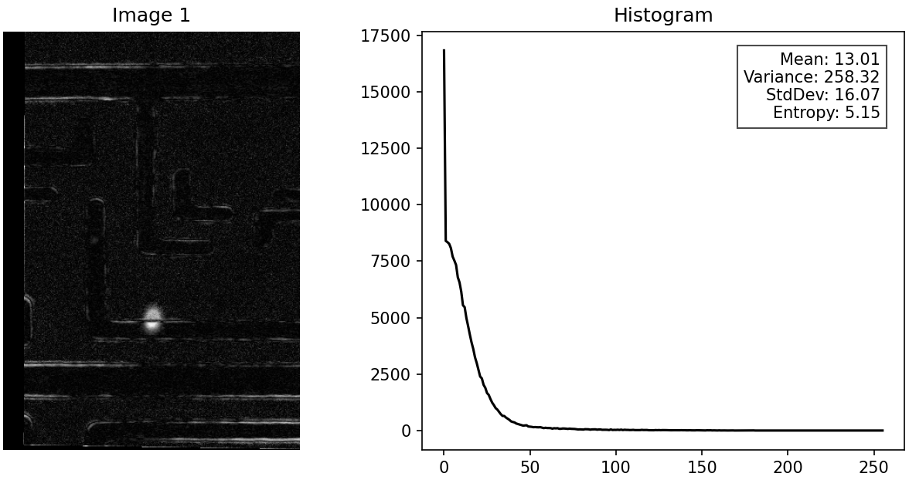 

*The difference image highlights some of these issues more clearly.*

For now, we leave the alignment as is and move on to other methods of defect detection with the current alignment. For future reference, it is possible to use ECC iterative refinement and use the homography as an initial point. There are other alternatives such as dense detector free methods and deep learning methods, we discuss this shortly with example for matching in future direction section.

## GMM 

The approach I was considering involves using a Gaussian Mixture Model (GMM), with the reference image serving as the background. The goal was to distinguish the defects as the foreground. Unfortunately, the edges of the patterns were also classified as foreground. 
GMM is a probabilistic model that assumes all points are generated from mixture of gaussian distributions. I used the GMM implemetation from scikit-learn which uses EM algorithm to git a model. The main disadvantage is that it requires a number of components.
I used 10 components in the training and applied a threshold at the 20th percentile for binary mask creation. These hyperparameters can be tuned.

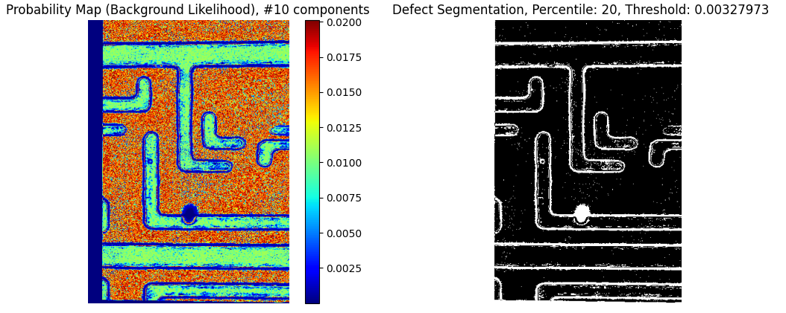

*On the right is the probability map, where blue indicates a high likelihood of being foreground and red indicates likely background.*

Since GMM produce results that contain edges as well, I decided to check other approach and see if I could get better results. 

## FFT 

We apply FFT transformation to both the aligned inspected image and the reference image. A high-pass filter is applied (with the filter size as a tunable parameter), followed by the computation of a difference image. Then, the inverse FFT is applied to convert the data back from the frequency domain to the spatial domain.
In the high-pass filter, the mask blocks the center, which in the spatial domain translates to sharp details and removal of smooth variations. In the low-pass filter, the mask preserves smooth details. I found that, in this context, the low-pass filter is preferable as it cleans up the noise while still capturing the defects.
We observe that the borders exhibit high differences, I tried to resolve it using zero padding, However, zero padding alone did not fully resolve the issue.

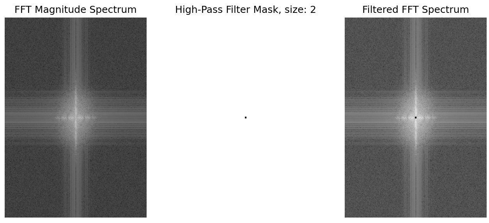 

*This image shows the FFT transformation. The black dot indicates that a filter of a certain size was applied; this is the high-pass filter.*

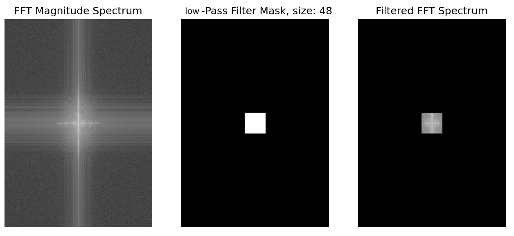 

*This image represents the low-pass filter, which yielded better results.*

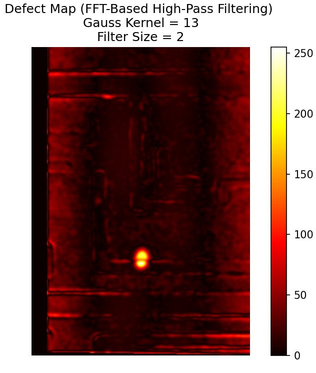 

*This is the difference image after processing in the frequency domain. The defects are clearly visible, but unfortunately, some of the edges are also present.*

## Voting Mechanism 

Now we want to combine the insights from the GMM and FFT approaches to create a combined defect map. This method is still under evaluation to ensure that both contributions are effectively integrated. I used multiplication but it is possible that other operations such as average might give better results. 

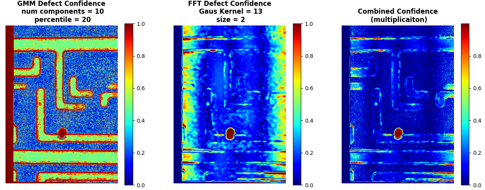 

*Here you can see the probability maps from the GMM, the FFT result, and their multiplication.*

## Postprocessing 

Finally, thresholding is applied. In my B.Sc. project, I categorized lesions based on morphological features, and I believe we could apply a similar approach here. The ability to define regular characteristics and distinguish irregular objects is crucial.
We can divide morphological characteristics into three main categories: form, shape, and orientation.
For example: Roundness and elliptic-normalized circumference describe shape, Orientation can be assessed using the length-to-width ratio and Margins can be characterized using the lobulation index. It would be better to select contours based on these characteristics, but this remains a subject for future work.

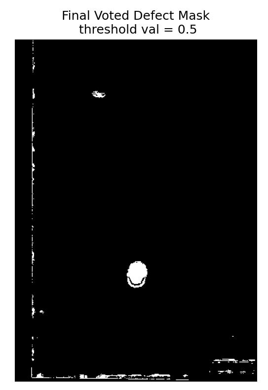 

*This is the current result. The next task will be to find a way to detect defect #2, and we also observed noise at the borders, which remains unresolved as zero padding alone did not help.*

## Evaluation 

The best approach would be to get the ground truth mask, and compare it with the output mask. 
to do this we need to invert the homography matrix and return the defect mask as the input inspected image was given. 
then we can compute the dice coefficient. 
it will be beneficial to compute the Precision and Recall. 
this will allow us to know if specific refinement were helpful according to the required task. 
maybe in this case high recall is preferable over missing some defects.
this section will be future work as well. 

## Summary and Future Directions

For summary, I used ORB for feature matching and alignment, then calculated the difference image, applied GMM and FFT, and combined the results before thresholding to produce a binary defect mask.
Overall, the approach is straightforward, simple, yet creative, fast, and generalized.

However, there are some limitations:

The method misses some defects and misclassifies others.
In the alignment step, while ORB performed better than SIFT, it is still not perfect. Since better alignment improves the difference image, refining this step is crucial.
Possible improvements include iterative methods like ECC or deep learning-based feature matching such as LoFTR.
We need to evaluate whether GMM adds useful information or if skipping it would be more effective.
In the FFT step, we need a method to enhance delicate defects, possibly using a coarse-to-fine approach.
Border effects remain an issue, as zero-padding did not help much.
It is beneficial to check other combination for the voting mechanism such as averaging. 
Exploring more sophisticated thresholding methods could further improve segmentation.
The task was both interesting and highly applicable to the semiconductor industry, and I truly enjoyed working on it.

## Appendix 

### Results for case 2

### Results for case 1 

### Deep Learning Feature Matching 

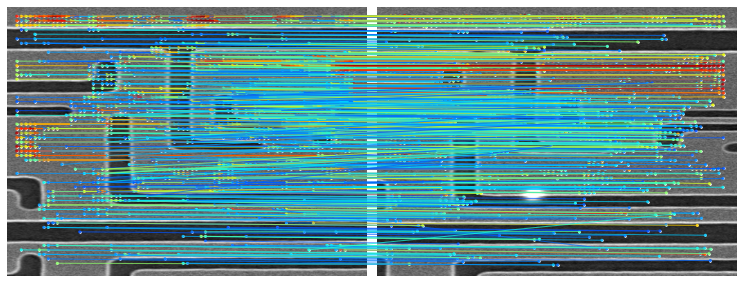 

Example for LoFTR matching, You can reproduce this matching using the notebook in the notebooks/ folder.
LoFTR (Local Feature TRansformer) is a detector-free feature matching approach, making it more efficient and faster compared to methods that rely on interest point detection. LoFTR leverages the Transformer architecture, which widens its receptive field, allowing it to better match features in low-texture or corner-poor areas.

some middle images for other cases: 
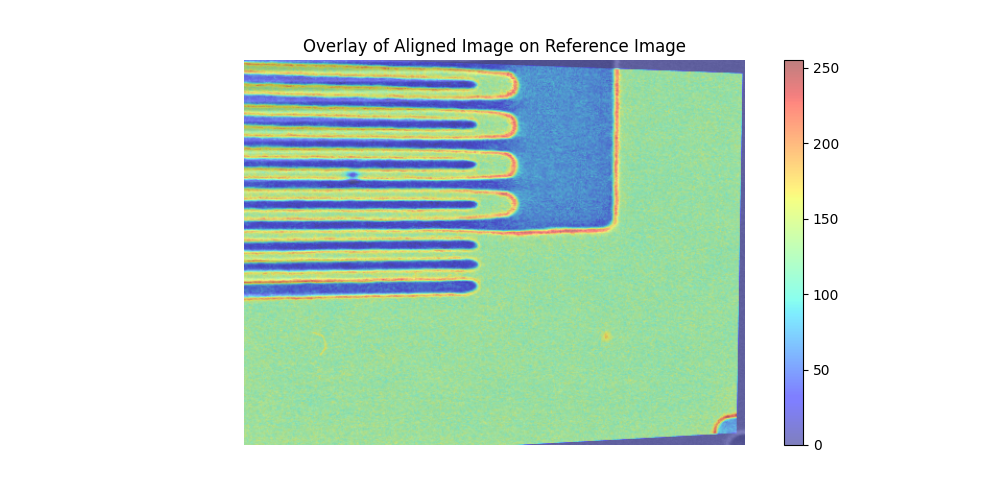 

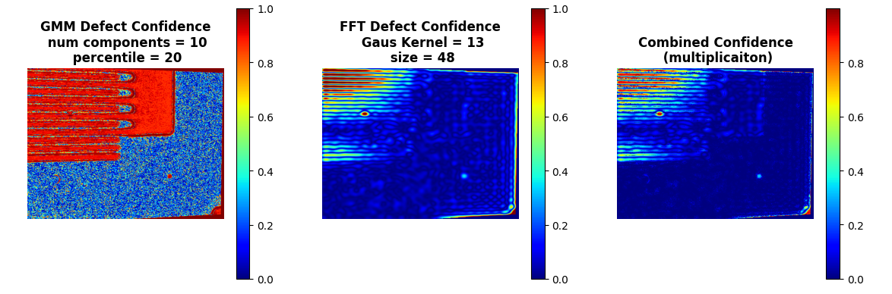 
